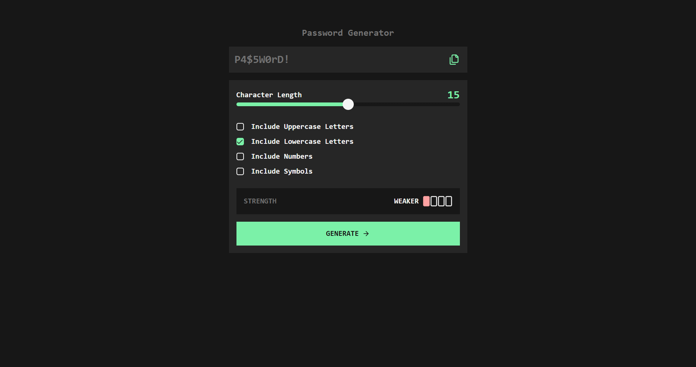

# Password Generator

Web-based random password generator.
  
Built based on this Frontend-Mentor challenge
 
(https://www.frontendmentor.io/challenges/password-generator-app-Mr8CLycqjh)

## Preview

## Features

Can generate with

- Lowercase letters
- Uppercase Letters
- Numbers
- Symbols
- Up to 30 characters

## Built with

- Svelte (https://svelte.dev/)
- SvelteKit (https://svelte.dev/)
- JavaScript
- Tailwindcss (https://tailwindcss.com/)
- Lucide Icons (https://lucide.dev/)

## Installation

    git clone https://github.com/drae528/password-generator.git
    cd password-generator
    npm install

## Build and Preview

    npm run build
    npm run preview

then open your browser at (http://localhost:4173/)
 (or as instructed by the terminal)

## Dev Mode

    npm run dev

then open your browser at (http://localhost:5173/)
 (or as instructed by the terminal)
